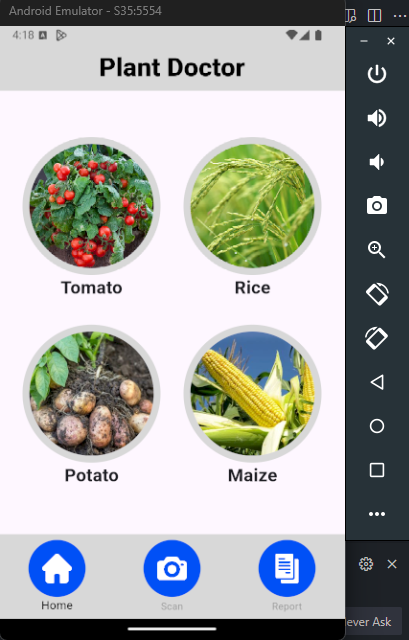
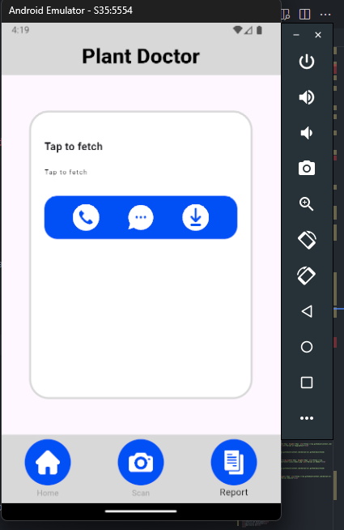

<div align="center">

# Plant Disease Prediction - AI-Based Detection Using CNN

<p id="intro">This project is an AI-powered plant disease prediction tool utilizing Convolutional Neural Networks (CNN). It is specialized for identifying diseases in maize, potato, tomato, and rice crops, helping farmers and agricultural professionals detect and manage crop diseases early.</p>

### Supported Platforms

[]()

#### Server

[]()

---

<p>

<span>
  <a href="https://github.com/darsan-in/WiseFarmer/commits/main">
    
  </a>
</span>

<span>
  <a href="">
    
  </a>
</span>

</p>

---

<p>

<span>
  <a href="LICENSE">
    
  </a>
</span>

<span>
  <a href="https://github.com/darsan-in/WiseFarmer/releases">
    
  </a>
</span>

</p>

<p>

<span>
  <a href="https://www.codefactor.io/repository/github/darsan-in/WiseFarmer/issues/main">
    
  </a>
</span>

</p>

---

<p>

<span>
  <a href="">
    
  </a>
</span>

<span>
  <a href="https://github.com/sponsors/darsan-in">
    
  </a>
</span>

</p>

---

</div>

## Table of Contents 📝

- [Features and Benefits](#features-and-benefits-)
- [Use Cases](#use-cases-)
- [Friendly request to users](#-friendly-request-to-users)

- [Setup - Step-by-Step Guide](#setup---step-by-step-guide-)
- [In-Action](#in-action-)

- [License](#license-%EF%B8%8F)
- [Contributing to Our Project](#contributing-to-our-project-)

- [Contact Information](#contact-information)

## Features and Benefits ✨

- **AI-Driven Disease Detection**: Utilizes CNN models trained specifically for maize, potato, tomato, and rice to accurately predict and diagnose plant diseases.
- **High Accuracy**: Leverages deep learning techniques to provide reliable and precise predictions.
- **Multi-Crop Support**: Specially designed to handle disease prediction for four major crops: maize, potato, tomato, and rice.
- **User-Friendly Interface**: Provides an easy-to-use interface for farmers and agricultural professionals to upload images and get instant results.
- **Scalable and Customizable**: Can be expanded to include more crops and diseases with additional training data.
- **Open Source**: Fully open-source with opportunities for further research and community-driven enhancements.

## Use Cases ✅

- **Agricultural Monitoring**: Helps farmers and agricultural experts monitor crop health and take timely action against diseases.
- **Precision Farming**: Supports precision farming practices by providing accurate disease predictions for specific crops.
- **Research and Development**: A valuable tool for researchers working on plant pathology and disease prevention.
- **Agricultural Education**: Can be used as an educational tool to teach students about plant diseases and modern agricultural practices.
- **Crop Management Systems**: Integrates with existing crop management systems to provide comprehensive health reports.
- **Government and NGO Programs**: Assists in large-scale agricultural programs aimed at improving crop yields and food security.

---

### 🙏🏻 Friendly Request to Users

Every star on this repository is a sign of encouragement, a vote of confidence, and a reminder that our work is making a difference. If this project has brought value to you, even in the smallest way, **please consider showing your support by giving it a star.** ⭐

_"Star" button located at the top-right of the page, near the repository name._

Your star isn’t just a digital icon—it’s a beacon that tells us we're on the right path, that our efforts are appreciated, and that this work matters. It fuels our passion and drives us to keep improving, building, and sharing.

If you believe in what we’re doing, **please share this project with others who might find it helpful.** Together, we can create something truly meaningful.

Thank you for being part of this journey. Your support means the world to us. 🌍💖

---

## Setup - Step-by-Step Guide 🪜

- **Step 1:** Clone this repo and open in VS Code.

```bash
git clone https://github.com/darsan-in/WiseFarmer.git
```

- **Step 2:** Resolve required packages using pub.

```bash
flutter pub get
```

- **Step 3:** Choose runtime device using <kbd>Ctrl</kbd> + <kbd>Shift</kbd> + <kbd>p</kbd>

```txt
>flutter: Select device
```

- **Step 4:** Now open `lib/main.dart` and press <kbd>F5</kbd> to install and open app in device you chose.

## In-Action 🤺




## License ©️

This project is licensed under the [MIT](LICENSE).

## Contributing to Our Project 🤝

We’re always open to contributions and fixing issues—your help makes this project better for everyone.

If you encounter any errors or issues, please don’t hesitate to [raise an issue](../../issues/new). This ensures we can address problems quickly and improve the project.

For those who want to contribute, we kindly ask you to review our [Contribution Guidelines](CONTRIBUTING) before getting started. This helps ensure that all contributions align with the project's direction and comply with our existing [license](LICENSE).

We deeply appreciate everyone who contributes or raises issues—your efforts are crucial to building a stronger community. Together, we can create something truly impactful.

Thank you for being part of this journey!

## Contact Information

For any questions, please reach out via hello@darsan.in or [LinkedIn](https://www.linkedin.com/in/darsan-in/).

---

<p align="center">

<span>
<a href="https://www.linkedin.com/in/darsan-in/"></a>
</span>

<span>
  
</span>

<span>
<a href="https://www.youtube.com/@darsan-in"></a>
</span>

<span>
  
</span>

<span>
<a href="https://www.facebook.com/darsan.in/"></a>
</span>

<span>
  
</span>

<span>
<a href="https://www.npmjs.com/~darsan.in"></a>
</span>

<span>
  
</span>

<span>
<a href="https://github.com/darsan-in"></a>
</span>

<span>
  
</span>

<span>
<a href="https://huggingface.co/darsan"></a>
</span>

<span>
  
</span>

<span>
<a href="https://www.reddit.com/user/iamspdarsan/"></a>
</span>

<span>
  
</span>

<span>
<a href="https://darsan.in/"></a>
</span>

<p>

---

#### Topics

<ul id="keywords">
<li>plant disease prediction</li>
<li>AI agriculture</li>
<li>CNN</li>
<li>maize disease detection</li>
<li>potato disease detection</li>
<li>tomato disease detection</li>
<li>rice disease detection</li>
<li>precision farming</li>
<li>crop management</li>
<li>agricultural technology</li>
<li>deep learning in agriculture</li>
<li>plant pathology</li>
<li>AI in farming</li>
<li>crop disease diagnosis</li>
<li>agricultural education</li>
<li>agricultural monitoring</li>
<li>food security</li>
<li>research and development</li>
<li>agriculture innovation</li>
<li>open-source AI</li>
</ul>
